# Meta AI - Real-Time Face Recognition & People Search

## Architecture

```mermaid
flowchart TD
    subgraph User_Device["User Device"]
        OBS["🎥 OBS Studio<br/>(Streams Video)"]
        BROWSER["🖥️ Web Browser<br/>(Dashboard UI)"]
    end
    subgraph Local_Infra["Local Streaming Infra"]
        NGINX["🟦 nginx-rtmp<br/>(Docker/Local)"]
        NGROK["🌐 ngrok Tunnel<br/>tcp://2.tcp.ngrok.io:14654"]
    end
    subgraph Cloud["Cloud Services"]
        RAILWAY["☁️ FastAPI Backend<br/>Railway"]
        VERCEL["☁️ React Frontend<br/>Vercel"]
    end
    OBS -- "RTMP Stream (rtmp://localhost:1935/live/test)" --> NGINX
    NGINX -- "RTMP (1935)" --> NGROK
    NGROK -- "Public RTMP URL (rtmp://2.tcp.ngrok.io:14654/live/test)" --> RAILWAY
    RAILWAY -- "REST API (status, profiles, upload)" --> VERCEL
    VERCEL -- "Web UI/API Calls" --> BROWSER
    BROWSER -- "User Interacts" --> VERCEL
    RAILWAY -- "Serves face images (https://.../faces/face_xxx.jpg)" --> VERCEL
    VERCEL -- "Loads face images" --> BROWSER
    OBS -. "(Optional HLS)" .-> NGINX
    NGINX -. "HLS (8080)" .-> NGROK
    NGROK -. "Public HLS URL (http)" .-> BROWSER
    NGINX -- "/stat, /hls endpoints" --> BROWSER
    RAILWAY -- "Env: RTMP_URL, API Keys" --- RAILWAY
    VERCEL -- "Env: REACT_APP_BACKEND_URL" --- VERCEL
    classDef cloud fill:#e0f7fa,stroke:#0288d1,stroke-width:2px;
    classDef local fill:#f3e5f5,stroke:#7b1fa2,stroke-width:2px;
    classDef user fill:#fffde7,stroke:#fbc02d,stroke-width:2px;
    class Cloud cloud;
    class Local_Infra local;
    class User_Device user;
```

This project uses a modern, cloud-friendly architecture for real-time face recognition from live video streams. Below is a detailed architecture diagram and explanation:



**Component Overview:**
- **OBS Studio:** Streams live video to the local RTMP server.
- **nginx-rtmp:** Receives RTMP streams locally (via Docker or native install).
- **ngrok:** Exposes the local RTMP server to the internet with a public TCP address.
- **Railway (Backend):** FastAPI backend processes the RTMP stream, detects faces, and serves face images and API endpoints.
- **Vercel (Frontend):** React dashboard for real-time status, uploads, and results display.
- **User Browser:** Interacts with the dashboard, uploads images, and views detected profiles (with face images).

**Cloud Streaming Flow:**
1. OBS streams to `rtmp://localhost:1935/live/test` (nginx-rtmp).
2. ngrok exposes the RTMP server at a public address (e.g., `rtmp://2.tcp.ngrok.io:14654/live/test`).
3. The backend (on Railway) connects to the public RTMP URL for processing.
4. Detected faces are saved and served as public URLs.
5. The frontend (on Vercel) displays real-time results and face images to the user.

---

A comprehensive real-time face recognition application with RTMP stream processing, reverse image search, people database searches, and GPT-powered profile summarization.

## 🚀 Features

### Core Functionality
- **Real-time RTMP Stream Processing** - Live face detection from OBS streams
- **Advanced Face Detection** - High-accuracy face recognition using OpenCV
- **Multi-Engine Reverse Image Search** - PimEyes, TinEye, Bing Visual, Google Lens
- **Comprehensive People Search** - FastPeopleSearch, CheckThem, Instant Checkmate
- **GPT-Powered Summarization** - Intelligent profile generation with OpenAI
- **Modern React Dashboard** - Real-time status updates and results display

### Enhanced API Integrations
- **TinEye API** - Official reverse image search API
- **Bing Visual Search API** - Microsoft Cognitive Services integration
- **PimEyes Automation** - Selenium-based web automation with authentication
- **OpenAI GPT-4** - Advanced profile summarization and analysis

### Advanced Web Scraping
- **Proxy Rotation** - Automatic proxy management for rate limiting
- **User-Agent Rotation** - Multiple browser signatures to avoid detection
- **Rate Limiting** - Intelligent request throttling with exponential backoff
- **Enhanced Parsing** - Sophisticated data extraction from search results

## 🛠️ Setup Instructions

### Prerequisites
- Docker and Docker Compose
- Python 3.8+
- Node.js 16+
- Chrome/Chromium browser (for PimEyes automation)

### 1. Clone and Setup
```bash
git clone <repository-url>
cd Meta-AI
```

### 2. Environment Configuration
Copy the environment template and configure your API keys:

```bash
cp env_template.txt .env
```

Edit `.env` with your API credentials:

```env
# OpenAI API Configuration
OPENAI_API_KEY=your_openai_api_key_here

# TinEye API Configuration
TINEYE_API_KEY=your_tineye_api_key_here

# Bing Visual Search API Configuration
BING_VISUAL_API_KEY=your_bing_visual_api_key_here

# PimEyes Credentials
PIMEYES_USERNAME=your_pimeyes_username
PIMEYES_PASSWORD=your_pimeyes_password

# Application Configuration
HOST=0.0.0.0
PORT=8000
DEBUG=True
CHROME_BIN=/usr/bin/chromium

# Optional: Proxy Configuration
USE_PROXIES=False
PROXY_LIST_URL=https://api.proxyscrape.com/v2/?request=get&protocol=http&timeout=10000&country=all&ssl=all&anonymity=all
```

### 3. API Key Setup

#### OpenAI API
1. Visit [OpenAI Platform](https://platform.openai.com/)
2. Create an account and get your API key
3. Add to `.env`: `OPENAI_API_KEY=sk-your-key-here`

#### TinEye API
1. Visit [TinEye API](https://services.tineye.com/developers/)
2. Sign up for API access
3. Add to `.env`: `TINEYE_API_KEY=your-tineye-key`

#### Bing Visual Search API
1. Visit [Microsoft Azure](https://azure.microsoft.com/en-us/services/cognitive-services/bing-visual-search/)
2. Create a Cognitive Services resource
3. Get your API key
4. Add to `.env`: `BING_VISUAL_API_KEY=your-bing-key`

#### PimEyes Credentials
1. Visit [PimEyes](https://pimeyes.com/)
2. Create an account
3. Add to `.env`: `PIMEYES_USERNAME=your-email` and `PIMEYES_PASSWORD=your-password`

### 4. Docker Deployment
```bash
# Build and start all services
docker-compose up --build

# Or run in background
docker-compose up -d --build
```

### 5. Manual Setup (Alternative)
If you prefer not to use Docker:

```bash
# Backend setup
cd backend
python -m venv venv
source venv/bin/activate  # On Windows: venv\Scripts\activate
pip install -r requirements.txt
python main.py

# Frontend setup (in another terminal)
cd frontend
npm install
npm start
```

## 📡 RTMP Stream Setup

### OBS Configuration
1. Open OBS Studio
2. Go to Settings → Stream
3. Set Service to "Custom"
4. Server: `rtmp://localhost/live`
5. Stream Key: `test` (or any key you prefer)

### Stream Processing
The system automatically:
- Detects faces in the RTMP stream
- Crops and saves face images
- Performs reverse image searches
- Searches people databases
- Generates comprehensive profiles

## 🔍 Search Engines & APIs

### Reverse Image Search
- **PimEyes** - Advanced facial recognition search
- **TinEye** - Official API integration
- **Bing Visual** - Microsoft Cognitive Services
- **Google Lens** - Manual search with instructions

### People Search Databases
- **FastPeopleSearch** - Enhanced web scraping
- **CheckThem** - Criminal records and background checks
- **Instant Checkmate** - Comprehensive background reports

### Enhanced Features
- **Proxy Rotation** - Automatic proxy management
- **Rate Limiting** - Intelligent request throttling
- **User-Agent Rotation** - Multiple browser signatures
- **Error Handling** - Graceful fallbacks and retry logic

## 🎯 Usage

### Web Dashboard
1. Open `http://localhost:3000` in your browser
2. Upload images or start RTMP processing
3. View real-time results and profiles
4. Access manual search links for verification

### API Endpoints
- `POST /upload-image/` - Upload and process single image
- `POST /create-comprehensive-profile/` - Full pipeline processing
- `POST /start-rtmp-processing/` - Start RTMP stream processing
- `GET /rtmp-profiles/` - Get processed profiles
- `GET /status/` - System status

### Manual Search Links
The system provides direct links to:
- Reverse image search engines
- People search databases
- Background check services

## 🔧 Configuration Options

### Docker Services
- **nginx-rtmp** - RTMP server for stream ingestion
- **backend** - FastAPI application with all search logic
- **frontend** - React dashboard for user interface

### Environment Variables
- `DEBUG` - Enable debug logging
- `USE_PROXIES` - Enable proxy rotation
- `CHROME_BIN` - Chrome/Chromium binary path
- `PROXY_LIST_URL` - Custom proxy list source

## 🚨 Important Notes

### Docker Limitations
- PimEyes automation is limited in Docker containers
- Use manual image upload for best results
- Consider running outside Docker for full automation

### API Rate Limits
- Respect API rate limits and terms of service
- Use proxy rotation for high-volume searches
- Implement appropriate delays between requests

### Legal Compliance
- Ensure compliance with local laws and regulations
- Respect privacy and data protection requirements
- Use search results responsibly and ethically

## 🐛 Troubleshooting

### Common Issues
1. **ChromeDriver crashes** - Use manual upload or run outside Docker
2. **API quota exceeded** - Check API key limits and billing
3. **Rate limiting** - Enable proxy rotation or increase delays
4. **Authentication errors** - Verify API keys and credentials

### Debug Mode
Enable debug logging:
```bash
export DEBUG=True
docker-compose up
```

### Manual Testing
Test individual components:
```bash
# Test PimEyes
curl http://localhost:8000/test-pimeyes/

# Test GPT
curl http://localhost:8000/test-gpt/

# Test face detection
curl -X POST http://localhost:8000/upload-image/ -F "file=@test.jpg"
```

## 📊 Performance Optimization

### Scaling Options
- **Horizontal scaling** - Multiple backend instances
- **Load balancing** - Nginx reverse proxy
- **Caching** - Redis for search results
- **Database** - PostgreSQL for profile storage

### Monitoring
- Real-time status dashboard
- Log aggregation and analysis
- Performance metrics tracking
- Error rate monitoring

## 🤝 Contributing

1. Fork the repository
2. Create a feature branch
3. Implement your changes
4. Add tests and documentation
5. Submit a pull request

## 📄 License

This project is licensed under the MIT License - see the LICENSE file for details.

## ⚠️ Disclaimer

This tool is for educational and research purposes only. Users are responsible for complying with all applicable laws and regulations regarding privacy, data protection, and search engine terms of service. 