# Meta AI Face Recognition

A full-stack real-time face recognition app using FastAPI (backend), React (frontend), and RTMP video streaming. Supports cloud deployment (Railway, Vercel) and local development. Detects faces from live video streams, performs reverse image search, and displays results in a modern UI.

---

## Architecture

```mermaid
flowchart TD
    subgraph User_Device["User Device"]
        OBS["🎥 OBS Studio<br/>(Streams Video)"]
        BROWSER["🖥️ Web Browser<br/>(Dashboard UI)"]
    end
    subgraph Local_Infra["Local Streaming Infra"]
        NGINX["🟦 nginx-rtmp<br/>(Docker/Local)"]
        NGROK["🌐 ngrok Tunnel<br/>tcp://2.tcp.ngrok.io:14654"]
    end
    subgraph Cloud["Cloud Services"]
        RAILWAY["☁️ FastAPI Backend<br/>Railway"]
        VERCEL["☁️ React Frontend<br/>Vercel"]
    end
    OBS -- "RTMP Stream (rtmp://localhost:1935/live/test)" --> NGINX
    NGINX -- "RTMP (1935)" --> NGROK
    NGROK -- "Public RTMP URL (rtmp://2.tcp.ngrok.io:14654/live/test)" --> RAILWAY
    RAILWAY -- "REST API (status, profiles, upload)" --> VERCEL
    VERCEL -- "Web UI/API Calls" --> BROWSER
    BROWSER -- "User Interacts" --> VERCEL
    RAILWAY -- "Serves face images (https://.../faces/face_xxx.jpg)" --> VERCEL
    VERCEL -- "Loads face images" --> BROWSER
    OBS -. "(Optional HLS)" .-> NGINX
    NGINX -. "HLS (8080)" .-> NGROK
    NGROK -. "Public HLS URL (http)" .-> BROWSER
    NGINX -- "/stat, /hls endpoints" --> BROWSER
    RAILWAY -- "Env: RTMP_URL, API Keys" --- RAILWAY
    VERCEL -- "Env: REACT_APP_BACKEND_URL" --- VERCEL
    classDef cloud fill:#e0f7fa,stroke:#0288d1,stroke-width:2px;
    classDef local fill:#f3e5f5,stroke:#7b1fa2,stroke-width:2px;
    classDef user fill:#fffde7,stroke:#fbc02d,stroke-width:2px;
    class Cloud cloud;
    class Local_Infra local;
    class User_Device user;
```



**Component Overview:**
- **OBS Studio:** Streams live video to the local RTMP server.
- **nginx-rtmp:** Receives RTMP streams locally (via Docker or native install).
- **ngrok:** Exposes the local RTMP server to the internet with a public TCP address.
- **Railway (Backend):** FastAPI backend processes the RTMP stream, detects faces, and serves face images and API endpoints.
- **Vercel (Frontend):** React dashboard for real-time status, uploads, and results display.
- **User Browser:** Interacts with the dashboard, uploads images, and views detected profiles (with face images).

**Cloud Streaming Flow:**
1. OBS streams to `rtmp://localhost:1935/live/test` (nginx-rtmp).
2. ngrok exposes the RTMP server at a public address (e.g., `rtmp://2.tcp.ngrok.io:14654/live/test`).
3. The backend (on Railway) connects to the public RTMP URL for processing.
4. Detected faces are saved and served as public URLs.
5. The frontend (on Vercel) displays real-time results and face images to the user.

---

## Prerequisites
- Node.js (18+)
- Python (3.10+)
- Docker (for nginx-rtmp)
- OBS Studio (for streaming)
- Railway, Vercel, and ngrok accounts

---

## Environment Variables

### Backend (.env)
- `RTMP_URL` - Public RTMP stream URL (from ngrok)
- `BASE_URL` - Public backend URL (e.g. Railway URL)
- `PIMEYES_EMAIL`, `PIMEYES_PASSWORD` - (Optional) For PimEyes automation

### Frontend (.env)
- `REACT_APP_BACKEND_URL` - Backend API URL (Railway or local)

---

## Local Development

### 1. Clone the repo
```bash
git clone https://github.com/sahejveersingh/meta-ai-face-recognition.git
cd meta-ai-face-recognition
```

### 2. Backend Setup
```bash
cd backend
python -m venv venv
source venv/bin/activate
pip install -r requirements.txt
cp ../env_local.txt .env
```

### 3. Frontend Setup
```bash
cd ../frontend
npm install
cp ../env_local.txt .env
npm start
```

### 4. RTMP Streaming (nginx-rtmp + ngrok)
- Start nginx-rtmp locally (see `nginx-rtmp.conf`)
- Start ngrok to expose RTMP:
```bash
ngrok tcp 1935
```
- Use the ngrok RTMP URL in OBS and as `RTMP_URL` in backend `.env`

---

## Cloud Deployment

### Backend (Railway)
- Deploy `/backend` folder
- Set environment variables in Railway dashboard (use Raw Editor for case sensitivity)
- Set `RTMP_URL` to your ngrok public RTMP address
- Set `BASE_URL` to your Railway backend URL

### Frontend (Vercel)
- Deploy `/frontend` folder
- Set `REACT_APP_BACKEND_URL` to your Railway backend URL in Vercel dashboard

---

## Useful Commands

### Backend
- Start backend locally: `uvicorn main:app --reload`
- Run with Docker: `docker-compose up --build`

### Frontend
- Start frontend locally: `npm start`
- Build for production: `npm run build`

### RTMP/Streaming
- Start nginx-rtmp: `docker-compose up nginx-rtmp` (if using Docker)
- Start ngrok: `ngrok tcp 1935`

---

## Troubleshooting
- **Images not showing in UI:** Ensure `BASE_URL` is set correctly on Railway and CORS is allowed for static files.
- **RTMP stream not detected:** Check OBS settings and ngrok tunnel.
- **Frontend not updating:** Check `REACT_APP_BACKEND_URL` in Vercel and local `.env`.

---

## Example .env Files

### env_local.txt (for local dev)
```
# Backend
RTMP_URL=rtmp://localhost:1935/live/test
BASE_URL=http://localhost:8000
PIMEYES_EMAIL=your@email.com
PIMEYES_PASSWORD=yourpassword

# Frontend
REACT_APP_BACKEND_URL=http://localhost:8000
```

### env_dev.txt (for cloud/dev)
```
# Backend
RTMP_URL=rtmp://<ngrok-tcp-host>:<ngrok-tcp-port>/live/test
BASE_URL=https://meta-ai-face-recognition-production.up.railway.app
PIMEYES_EMAIL=your@email.com
PIMEYES_PASSWORD=yourpassword

# Frontend
REACT_APP_BACKEND_URL=https://meta-ai-face-recognition-production.up.railway.app
```

---

## Credits
- Built by Sahejveer Singh Kumar
- Powered by FastAPI, React, Railway, Vercel, ngrok, and open-source tools 